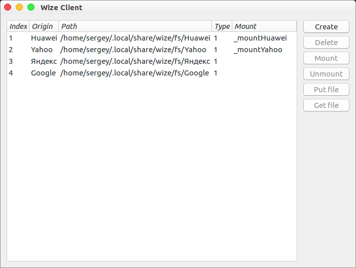
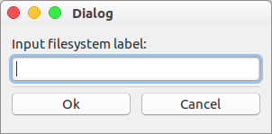
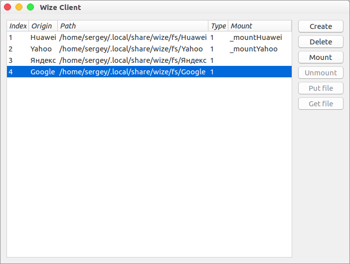
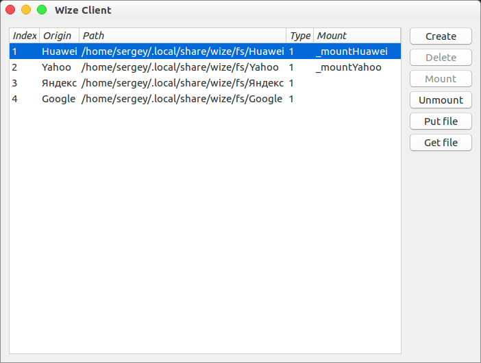

## Setup

go version go1.9.2

System: Linux amd64.

## Install

GUI application is based on platform-native GUI library `andlabs/ui`, we have fork of this library `leedark/ui` and you should get it by `go get`:

```
go get -u github.com/leedark/ui
```

Then you should go to the directory `wizefs\ui` and run `go build`.

## Main window




## Create filesystem dialog




## Mount filesystem




## Unmount filesystem, put and get file

