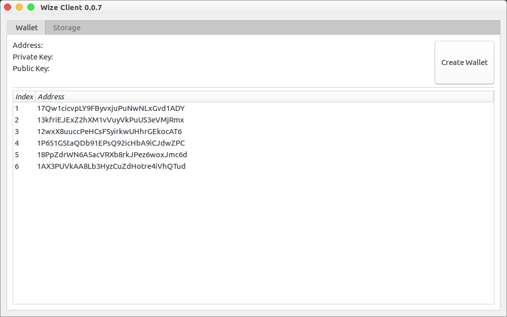
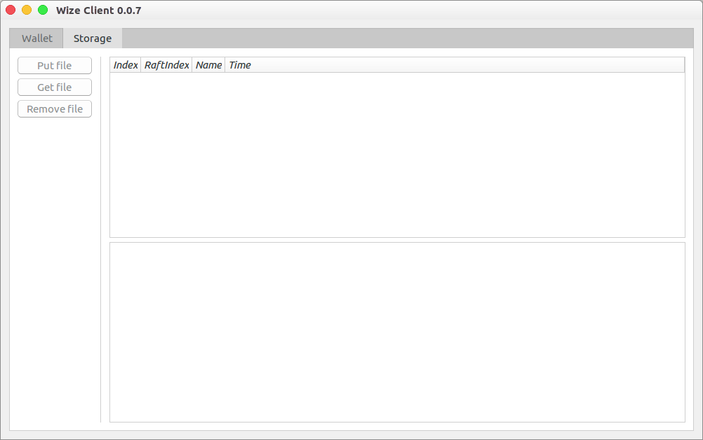
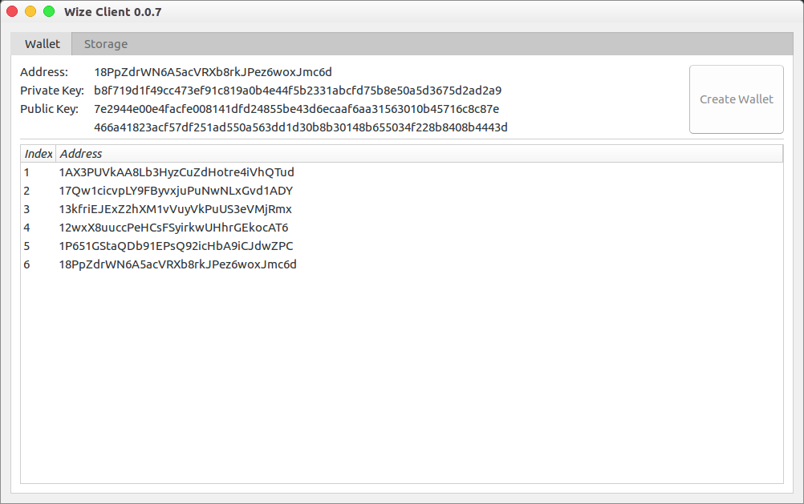
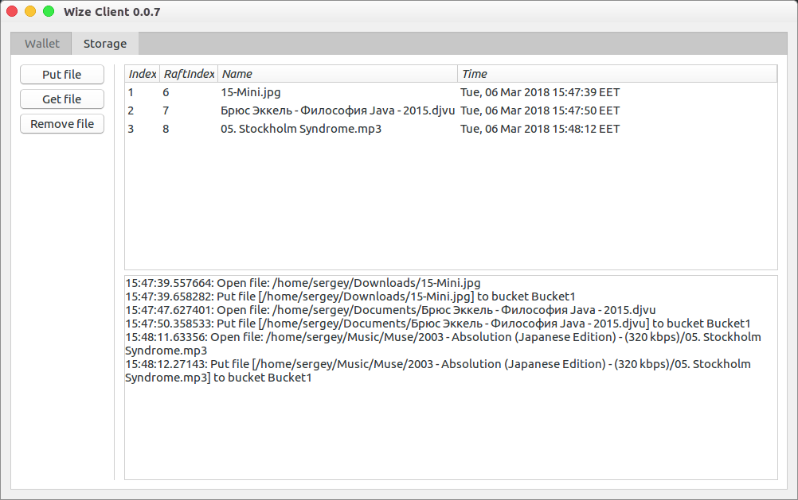

## Setup

go version go1.9.2

System: Linux amd64.

## Install

### Построение приложения

Для работы приложения необходимо построить утилиту wizefs, для этого необходимо зайти в директорию `wizefs` и запустить `go build`.

GUI application is based on platform-native GUI library `andlabs/ui`, we have fork of this library `leedark/ui` and you should get it by `go get`:

```
go get -u github.com/leedark/ui
```

Then you should go to the directory `wizefs/ui` and run `go build`.

### Разворачивание и старт кластера


## Main Window

Приложение имеет две вкладки (Tab): Wallet и Storage. 






## Wallet Tab

На вкладке Wallet отображается информация о кошельке пользователя и список кошельков, полученных через WizeBlock API.

Для создания кошелька необходимо нажать кнопку Create Wallet. После чего кошелек будет создан и информация о нем обновится. Также обновится список кошельков, в который добавится только что созданный кошелек пользователя.




## Storage Tab

До создания кошелька пользователя фунциональность вкладки Storage недоступна.

Если кошелек пользователя уже создан, то мы можем выполнять действия со Storage: Put file, Get file и Remove file. Также будет доступен список файлов, загруженных пользователем.



Все действия с файлами записываются в журнал, расположенный под списком файлов.